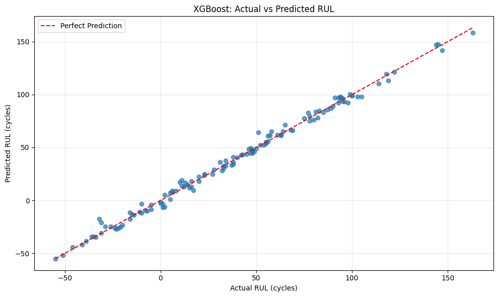

## Battery RUL Prediction Notebook Guide

This repository contains the `battery_RUL.ipynb` notebook for predicting **Remaining Useful Life** (RUL) of batteries.

### Prerequisites
- Python 3.x
- Jupyter Notebook
- Required libraries (pandas, numpy, sklearn, matplotlib, seaborn, xgboost)

### Usage Instructions
1. Clone this repository
2. Install required dependencies
3. Open `battery_RUL.ipynb` in Jupyter Notebook
4. Run cells sequentially from top to bottom
5. Follow in-notebook comments and documentation

### Dataset
source: https://www.nasa.gov/intelligent-systems-division/discovery-and-systems-health/pcoe/pcoe-data-set-repository/

### Output
The notebook generates:
- Data visualizations
- Model performance metrics
- RUL predictions for test batteries

### Result
**RMSE: 3.78 cycles**

